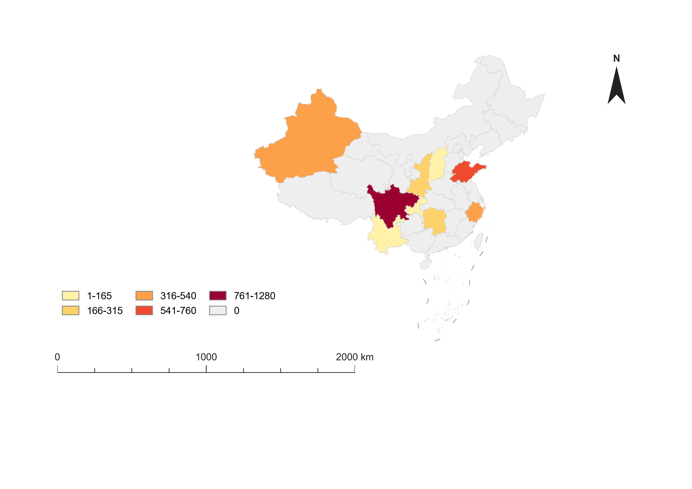

# ChinaChoroKit

**ChinaChoroKit** is a configuration-driven Python toolkit for drawing China province-level choropleth maps with the nine-dash line. It is designed for GIS coursework, reports, and research figures where the map needs to be reproducible, editable, and clean enough to use as an illustration.



## What It Does

- Reads a China province GeoJSON boundary file.
- Detects the nine-dash line feature from `adcode` values containing `JD`.
- Joins province-level values from a CSV file.
- Draws a graduated color choropleth map.
- Adds a legend, scale bar, and north arrow.
- Exports publication-friendly `PNG` and editable `SVG`.
- Uses a YAML configuration file so data, breaks, colors, layout, and outputs can be changed without editing Python code.

The default layout is a compact figure layout: the map body is placed on the right, while the legend and scale bar are grouped on the lower-left side to reduce vertical whitespace.

## Project Structure

```text
.
├── config/
│   └── example_china_map.yaml
├── data/
│   └── province_values.csv
├── docs/
│   └── classification_methods.md
├── assets/
│   └── china_province_choropleth.png
├── output/
│   ├── china_province_choropleth.png
│   └── china_province_choropleth.svg
├── src/
│   └── medmap_china/
│       └── render.py
├── 中华人民共和国.geojson
├── pyproject.toml
├── requirements.txt
└── environment.yml
```

## Quick Start With uv

`uv` is the recommended modern workflow for this project because it can create a virtual environment and install dependencies from `pyproject.toml` with one command.

```bash
uv sync
uv run china-choro --config config/example_china_map.yaml
```

If you want to run the script path directly:

```bash
uv run python src/medmap_china/render.py --config config/example_china_map.yaml
```

This repository does not commit `uv.lock` by default because the local machine used to prepare the project does not currently have `uv` installed. After installing `uv`, you can generate a lockfile with:

```bash
uv lock
```

Commit `uv.lock` if you want fully pinned, reproducible installs.

## Alternative Setup

### pip

```bash
python -m venv .venv
source .venv/bin/activate
pip install -r requirements.txt
python src/medmap_china/render.py --config config/example_china_map.yaml
```

On Windows PowerShell:

```powershell
python -m venv .venv
.\.venv\Scripts\activate
pip install -r requirements.txt
python src\medmap_china\render.py --config config\example_china_map.yaml
```

### conda

GeoPandas depends on GDAL/PROJ. On Windows, conda-forge is often the most reliable installation route.

```bash
conda env create -f environment.yml
conda activate chinachorokit
python src/medmap_china/render.py --config config/example_china_map.yaml
```

## Input Data

Edit `data/province_values.csv`:

```csv
province,value
四川,1280
浙江,540
陕西,315
湖南,225
云南,85
山东,760
重庆,45
新疆,420
山西,165
```

The included values are synthetic demo data. They are only used to demonstrate the rendering workflow and should not be interpreted as real measurements.

Province names can be short names or full administrative names. For example, `四川省`, `重庆市`, and `新疆维吾尔自治区` are normalized to `四川`, `重庆`, and `新疆`.

## Classification

The default classification is designed to mimic a common ArcGIS graduated color workflow:

1. Treat `0` or missing values as a separate gray class.
2. Apply Fisher-Jenks / Natural Breaks to positive values only.
3. Split positive values into 5 classes.

For the included sample data, the resulting legend classes are:

```text
0
1-165
166-315
316-540
541-760
761-1280
```

The positive-value breaks are computed from the CSV, so they will update automatically when the data changes.

Supported classification methods:

| Method | GIS Meaning | When To Use |
|---|---|---|
| `manual` | Manual interval | Fixed report standards or class breaks specified by a teacher/project |
| `equal_interval` | Equal interval | Simple interpretation when values are evenly distributed |
| `quantile` | Quantile | Balanced number of regions in each class |
| `natural_breaks` | Fisher-Jenks / Natural breaks | Skewed data or natural clusters |
| `defined_interval` | Defined interval | Stable interval width across maps |

See [docs/classification_methods.md](docs/classification_methods.md) for a fuller explanation.

## Configuration

Most map behavior is controlled by `config/example_china_map.yaml`.

Key sections:

| Section | Purpose |
|---|---|
| `map` | Canvas size, projection, layout, output paths |
| `geojson` | Boundary file path and field names |
| `data` | CSV path and data columns |
| `classification` | Classification method, class count, zero handling |
| `style` | Colors, no-data color, boundary line style |
| `legend` | Legend position, size, columns, labels |
| `scale_bar` | Scale bar style, length, tick labels |
| `north_arrow` | North arrow position and style |

## Outputs

Running the example config writes:

```text
output/china_province_choropleth.png
output/china_province_choropleth.svg
```

The PNG is suitable for reports and slides. The SVG can be edited in Illustrator, Inkscape, PowerPoint, or other vector tools.

## GitHub Notes

This repository is prepared for direct GitHub upload:

- `.gitignore` excludes Python caches, virtual environments, logs, and local editor noise.
- `.gitattributes` marks generated images as binary and normalizes text files.
- `.editorconfig` keeps indentation and UTF-8 behavior consistent.
- `.github/workflows/render-example.yml` renders the example map in GitHub Actions.
- `.github/ISSUE_TEMPLATE/bug_report.md` provides a basic issue template.

Before publishing as a formal open-source project, choose a license and add a `LICENSE` file. MIT or Apache-2.0 are common permissive options, but the choice affects reuse terms and should be deliberate.

## Data Source Notice

The GeoJSON boundary file should be accompanied by a clear data source and license notice before public release. If the boundary file came from a third-party dataset, verify whether redistribution is allowed.

## Project Positioning

Suggested short description:

> A configurable Python toolkit for drawing China province-level choropleth maps with the nine-dash line.

Suggested repository name:

```text
ChinaChoroKit
```
